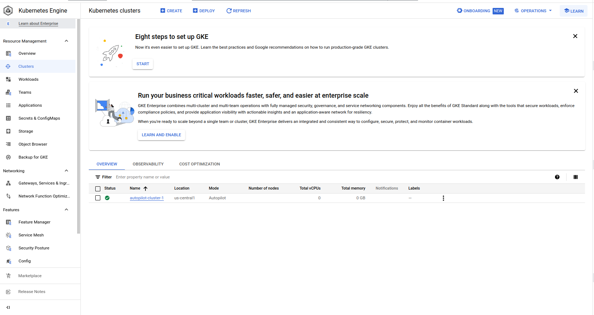

# MLOps

## Creating a k8s cluster with GCP
- Enable [Kubernets Engine API](https://console.cloud.google.com/marketplace/product/google/container.googleapis.com)
- Go to [Kubernets Engine](https://console.cloud.google.com/kubernetes) and create a cluster


## Creating VM


## Terraform
### Install
- Install from [Terraform](https://developer.hashicorp.com/terraform/tutorials/aws-get-started/install-cli#install-cli)
- Install the [gcloud CLI](https://cloud.google.com/sdk/docs/install) 
### How-to
Authenticate with GCP
```shell
gcloud auth application-default login
```
then
```
terraform init
terraform plan

```